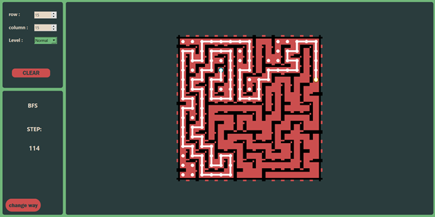

<p align="center">
  
</p>

<h1 align="center">🧩 Maze  – A Qt-based C++ Application for Random Maze Generation and Interactive Navigation</h1>

<p align="center">
  A desktop-based maze game developed in **C++** using the **Qt** framework. This application features a graphical user interface (GUI) that allows players to navigate through randomly generated mazes, offering an engaging and interactive gaming experience.
</p>


## 🎮 Features

- ✅ Random maze generation at each run.
- 🧭 Manual navigation through the maze using keyboard
- 🧠 Step-by-step automated solvers:
  - **Depth-First Search (DFS)**
  - **Breadth-First Search (BFS)**
  - **Bidirectional Search**
- 🔄 Restart and regenerate maze on demand
- 🖼️ User-friendly GUI with Qt
- 📚 Focus on clarity and pedagogy


## 🧠 Algorithms Overview

This application supports three classical search algorithms, each with unique characteristics. You can visualize them step-by-step using the `>>` button.

| Algorithm         | Finds Shortest Path? | Speed           | Description                                                  |
|-------------------|----------------------|------------------|--------------------------------------------------------------|
| **Depth-First Search (DFS)**     | ❌                   | 🚀 Fast (but blind) | Explores as far as possible along each branch before backtracking. May find suboptimal paths. |
| **Breadth-First Search (BFS)**   | ✅                   | 🐢 Slower            | Explores all neighbors level-by-level. Guaranteed to find the shortest path. |
| **Bidirectional Search**         | ✅                   | ⚡ Fastest            | Starts from both start and goal, meets in the middle. Efficient for large symmetric mazes. |


## 📦 Installation

### Requirements
- [Qt 5/6 + Qt Creator](https://www.qt.io/download)
- A C++ compiler (e.g., GCC, Clang, MSVC)

### Steps
1. **Clone the Repository**

```bash
git clone https://github.com/sepehrgh98/Maze.git
cd Maze
```
2. Open in Qt Creator
- Navigate to ```GUI/Maze_GUI/```

- Open the ```Maze.pro``` file

3. Build and Run

- Use the default kit or configure a build kit

- Click Run to launch the app


## 🚀 How to Use

1. Generate Maze: 

set number of rows and columns and Press the Generate button to generate a new maze.

<p align="center">  </p>


2. Select Solver:Press Go button. 

#### Click DFS to start Depth-First Search. Click the **>>** button to advance the algorithm by one step. 

<p align="center">  </p> 

<p align="center">  </p> 

Click BFS for Breadth-First Search. Click the **>>** button to advance the algorithm by one step.

<p align="center">  </p> 

<p align="center">  </p> 

Click Bidirectional for bidirectional exploration. Click the **>>** button to advance the algorithm by one step.

<p align="center">  </p> 

<p align="center">  </p> 

3. Watch & Learn: Follow the algorithm as it explores the maze.


## 📄 License

This project is licensed under the [MIT License](LICENSE).


## 🙏 Acknowledgments

This project was developed as part of an educational initiative to explore classic pathfinding algorithms through interactive visualization.

Special thanks to:

- The developers of the **Qt Framework** for making cross-platform GUI development accessible and powerful.
- Academic resources and open-source communities that provided foundational knowledge on **graph traversal algorithms**.
- My instructors and peers who provided feedback and inspiration during the development of this project.

Maze-solving algorithms implemented in this project (DFS, BFS, Bidirectional Search) are based on standard computer science principles taught in data structures and AP courses.


## 📬 Contact

If you have any questions or feedback, feel free to contact us at:

📧 sepehrghamri@gmail.com

